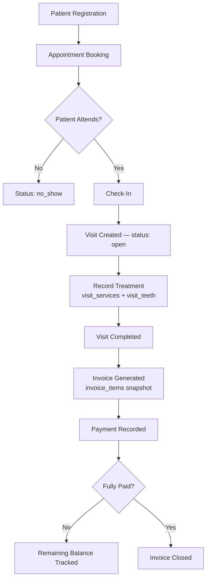

# PRD — نظام إدارة عيادة الأسنان (Dental Clinic Management System)

**الإصدار:** V1.2 (يدمج إكمال الوحدات المالية والمخزون)
**آخر تحديث:** يوليو 2026
**الحالة:** الوحدات التأسيسية، السريرية، المالية، والمخزون مكتملة بنيوياً ومختبرة بالكامل — الـ HTTP Layer وربط الـ Frontend قيد الانتظار

---

## 1. نظرة عامة

نظام ويب احترافي لإدارة كافة عمليات عيادة أسنان: من تسجيل المريض وحجز الموعد، مروراً بتوثيق الزيارة والعلاج، وصولاً لإصدار الفواتير وإدارة المخزون والتقارير المالية.

النظام مصمم للاستخدام اليومي داخل العيادة، بحيث يرى كل موظف الوظائف المخصصة له فقط بحسب صلاحياته. الهدف ليس تطبيق CRUD بسيطاً، بل نظام قريب من معايير الأنظمة المؤسسية (Enterprise-grade) من حيث سلامة البيانات تحت التزامن، وقابلية التوسع، وسهولة الصيانة على المدى الطويل.

## 2. المكدس التقني

| الطبقة | التقنية |
|---|---|
| Backend API | Laravel (13) |
| Frontend | React.js + Next.js |
| قاعدة البيانات | MySQL / MariaDB |
| المصادقة | Laravel Sanctum (SPA-friendly tokens) |
| الصلاحيات | Spatie Laravel Permission |
| تخزين الملفات | Laravel Filesystem (public disk حالياً، قابل للتبديل لـ S3 دون تعديل الكود) |

## 3. المستخدمون والأدوار

الأدوار الأساسية (عبر Spatie، وليس جدولاً يدوياً):

| الدور | الوصف |
|---|---|
| `super-admin` | يرى جميع الفروع، لا يتبع فرعاً واحداً (`branch_id = null`) |
| `admin` | يدير فرعه فقط |
| `doctor` | يرى مرضاه ومواعيده فقط |
| `receptionist` | يدير المرضى والمواعيد |
| `accountant` | يتابع الفواتير والمدفوعات |
| `inventory-manager` | يدير المواد الطبية |

**قاعدة معمارية ثابتة:** `is_super_admin` على `users` هو *علم أداء* (denormalized flag) يُزامَن مع دور `super-admin` الحقيقي في Spatie — وليس مصدر الصلاحية بحد ذاته.

## 4. مخطط سير العمل (Workflow Diagram)

المسار الأساسي الكامل لدورة حياة المريض داخل النظام، من التسجيل حتى الدفع:



**ملاحظة معمارية:** كل سهم في هذا المخطط يمثل إما تغيير حالة محكوماً بقاعدة عمل صريحة (مثل `VisitEditabilityGuard`)، أو Service Layer كامل (مثل `CheckInPatientService`) — وليس مجرد CRUD مباشر على الجدول.

## 5. المبادئ المعمارية الحاكمة

هذه القواعد طُبِّقت باتساق عبر كل وحدة بُنيت حتى الآن، وتحكم أي وحدة قادمة:

1. **لا حذف فعلي للسجلات الطبية أو المالية.** الحذف المنطقي يتم عبر `status` أو `SoftDeletes` — أبداً حذف حقيقي يفقد التاريخ. الجداول المرجعية (lookup tables) وحدها بلا `SoftDeletes`.
2. **Snapshot عند نقطة الخدمة (Controlled Denormalization).** أي بيانات تُستخدم في لحظة تقديم خدمة تُنسخ داخل السجل التشغيلي وقت الإنشاء، ولا تُشتق حياً من الجداول المرجعية لاحقاً. مطبَّق في: `visit_services.unit_price`, `visits.{patient_id,doctor_profile_id,branch_id}`, `visit_teeth.patient_id`, ومستقبلاً `invoice_items`.
3. **Service Layer صريح، لا Observers لعمليات الأعمال الحرجة.** أي عملية تمثل "معاملة تجارية" تُكتب كطبقة Service صريحة ضمن `DB::transaction()`، وليس ضمنياً عبر Model Events.
4. **الأمان تحت التزامن (Concurrency Safety) ليس اختيارياً.** أي عملية إنشاء رقم تسلسلي أو حجز فترة زمنية محمية بـ `lockForUpdate()`، مع اختيار دقيق لأي صف يُقفل (انظر ADR-004).
5. **الأرقام المرجعية القابلة للقراءة بشرياً** عبر مولّد عام واحد (`DocumentNumberGenerator`) يستخدم جدول `counters`.
6. **قواعد العمل المشتركة تُستخرَج فور تكرارها مرتين** (مثال: `VisitEditabilityGuard`).
7. **YAGNI محسوب، وليس تسرّعاً.** ميزات تُؤجَّل عمداً، لكن مع تصميم البنية التحتية بحيث لا تتطلب إعادة هيكلة عند الإضافة لاحقاً.
8. **تعدد الفروع من البداية، دون تفعيله كاملاً الآن.**
9. **الفاتورة snapshot أيضاً.** `invoice_items` تنسخ الوصف والسعر وقت الفوترة، مستقلة تماماً عن `visit_services` بعد إصدارها (انظر القسم 8).
10. **لا نخزن قيماً مشتقة إلا عند الحاجة الفعلية للأداء.** مثال: `remaining_balance` على الفاتورة **لا يُخزَّن** كعمود — يُحسب دائماً كـ `invoice.total - SUM(payments.amount)`، إلا إذا أثبت القياس الفعلي حاجة للتخزين المؤقت (caching) لاحقاً.

## 6. سجلات القرارات المعمارية (Architectural Decision Records)

| ADR | القرار | البديل المرفوض | السبب |
|---|---|---|---|
| ADR-001 | استخدام Spatie Laravel Permission | نظام صلاحيات مخصص (`roles`/`permissions` يدوية) | تجنب إعادة اختراع نظام مُختبَر ومعياري في المجتمع |
| ADR-002 | Service Layer بدل منطق داخل Controllers أو Observers | Fat Controllers / Model Events (`creating`, `saving`) | العمليات الحرجة تحتاج صراحة، قابلية اختبار، وتتبع واضح ضمن `DB::transaction()` |
| ADR-003 | Controlled Denormalization (Snapshot) في السجلات التشغيلية | الاعتماد الحي على الجداول المرجعية (live joins) | الأنظمة الطبية/المالية يجب أن تحتفظ بحالة البيانات وقت الحدث، لا وقت الاستعلام |
| ADR-004 | Proxy Lock (قفل صف الطبيب) لحجز المواعيد | `lockForUpdate()` مباشر على نتائج بحث التعارض | نتائج البحث قد تكون فارغة تماماً وقت التزامن، فلا شيء يُقفل فعلياً — تم التحقق بفحص HTTP متزامن حقيقي |
| ADR-005 | فترة نصف مفتوحة `[start, end)` لتداخل المواعيد | فترة مغلقة `[start, end]` | تسمح بحجز موعد يبدأ عند انتهاء آخر تماماً، وهو سلوك العيادات الطبيعي |
| ADR-006 | `DocumentNumberGenerator` عام واحد لكل الترقيم التسلسلي | كلاس منفصل لكل نوع (`PatientNumberGenerator`, `InvoiceNumberGenerator`...) | تجنب تكرار منطق القفل والـ retry في كل وحدة جديدة |
| ADR-007 | `is_super_admin` كعلم أداء مُزامَن، Spatie هو مصدر الحقيقة | الاعتماد فقط على `hasRole()` في كل استعلام | توازن بين الأداء (تجنب join متكرر) وصحة مصدر واحد للحقيقة |
| ADR-008 | لا نخزّن `remaining_balance` كعمود | تخزينه وتحديثه عند كل دفعة | يُحسب من `invoices.total - SUM(payments)` دائماً؛ التخزين المسبق مصدر لأخطاء تزامن غير ضرورية في V1 |
| ADR-009 | ربط الخدمة بالمخزون عبر قالب استهلاك (`service_inventory_consumption`) لا ربط مباشر | خصم مباشر من `inventory_items` عند إنشاء `visit_services` | خدمة واحدة قد تستهلك عدة مواد بكميات مختلفة؛ القالب يفصل "ماذا تستهلك الخدمة نظرياً" عن "ماذا حدث فعلياً" (`inventory_transactions`) |

## 7. الاتجاه المعماري المستهدف (Domain-Oriented Direction)

حجم المشروع الحالي لا يزال يبرر بنية `app/Services/` المسطحة المستخدمة الآن. لكن الاتجاه المستهدف مستقبلاً، مع نمو Financial وInventory، هو الانتقال التدريجي نحو تنظيم حسب النطاق (Domain) بدل النوع التقني:

```
app/
└── Domain/
    ├── Patients/
    │   ├── Services/
    │   ├── Models/
    │   └── Exceptions/
    ├── Appointments/
    ├── Visits/
    ├── Billing/
    └── Inventory/
```

**هذا ليس قراراً تنفيذياً الآن** (YAGNI) — بل توثيق للاتجاه، حتى تُبنى الوحدات القادمة (Billing، Inventory) بأسماء ومساحات تسهّل النقل لاحقاً دون إعادة تسمية جذرية.

## 8. نموذج البيانات — حسب المرحلة

### المرحلة 1: Foundation ✅ (مكتملة ومُختبرة)

| الجدول | الغرض |
|---|---|
| `specialties` | تخصصات الأطباء (مرجعي) |
| `service_categories` | فئات الخدمات (مرجعي) |
| `services` | الخدمات المقدَّمة، بسعر افتراضي قابل للتعديل لكل حالة |
| `branches` | فروع العيادة |
| `counters` | عدّاد آمن تحت التزامن لتوليد الأرقام المرجعية |
| `roles` / `permissions` (Spatie) | الصلاحيات |
| `users` (+`branch_id`, `is_super_admin`) | المستخدمون |
| `doctor_profiles` | الهوية المهنية للطبيب، منفصلة عن حساب الدخول |

### المرحلة 2: Clinical V1 ✅ (مكتملة بنيوياً)

| الجدول | الغرض |
|---|---|
| `patients` | البيانات الشخصية، مع `patient_number` مولَّد آلياً |
| `patient_medical_profiles` | الملف الطبي (1-1 مع المريض)، مع `questionnaire_answers` JSON قابل للتوسع |
| `appointments` | الحجز، محمي من التعارض الزمني تحت التزامن الحقيقي (مُختبَر فعلياً) |
| `visits` | الزيارة الفعلية، تُنشأ فقط عبر Check-In، تحمل snapshot كامل |
| `visit_services` | الخدمات المقدَّمة ضمن الزيارة، بسعر محفوظ وقت الاستخدام |
| `teeth` / `tooth_conditions` / `tooth_surfaces` | مرجع المخطط السني |
| `visit_teeth` | المخطط السني الفعلي، مرتبط اختيارياً بخدمة مفوترة |
| `attachments` | **مصمَّم بالكامل، الميزة (الرفع) مؤجلة لـ V1.5** |

### المرحلة 3: Financial — ⏳ لم تُبنَ بعد (مُحدَّثة حسب المراجعة)

| الجدول | الغرض (مخطط) |
|---|---|
| `invoices` | رأس الفاتورة: رقم مرجعي، الزيارة المرتبطة، الحالة، الإجمالي |
| `invoice_items` | **جديد** — بنود الفاتورة، Snapshot لكل بند من `visit_services` وقت الإصدار (الاسم، السعر، الكمية) — لا مرجع حي لـ `visit_services` بعد الإصدار |
| `payments` | دفعات جزئية/كاملة على الفاتورة |
| `expenses` | مصاريف العيادة (لتقارير الأرباح) |

**قاعدة عمل ثابتة (ADR-008):**
```
Remaining Balance = Invoice.total − SUM(Payments.amount)
```
لا يُخزَّن كعمود إلا عند إثبات حاجة أداء فعلية.

**نقطة معمارية معلَّقة:** حماية تحديث حالة الفاتورة عند دفعات متزامنة — يحتاج نفس نمط القفل المطبَّق على المواعيد (ADR-004)، مع تفاصيل تختلف حسب طبيعة "الدفعة الجزئية" مقابل "حجز فترة زمنية".

### المرحلة 4: Inventory — ⏳ لم تُبنَ بعد (مُحدَّثة حسب المراجعة)

| الجدول | الغرض (مخطط) |
|---|---|
| `inventory_items` | المواد والأدوات الطبية |
| `suppliers` | الموردون |
| `purchases` | المشتريات الجديدة |
| `service_inventory_consumption` | **جديد (ADR-009)** — قالب: أي مادة وبأي كمية تستهلكها كل خدمة نظرياً (مثال: Root Canal → 2 قفازات + 1 إبرة + 3 قطن) |
| `inventory_transactions` | الحركة الفعلية للمخزون (خصم/إضافة)، تُنشأ من القالب أعلاه عند تنفيذ الخدمة فعلياً |

**لماذا قالب استهلاك وليس ربطاً مباشراً؟** خدمة واحدة قد تستهلك عدة مواد بكميات مختلفة؛ الفصل بين "ماذا يجب أن تستهلك الخدمة نظرياً" (القالب) و"ماذا استُهلك فعلياً" (Transaction) يسمح بتعديل لاحق (مثلاً نقص مادة واستبدالها في حالة معينة) دون كسر النموذج.

**نقطة معمارية معلَّقة:** سلوك النظام عند نفاد المخزون أثناء تسجيل زيارة تستهلكه (منع، تحذير، أم سماح برصيد سالب) — قرار عمل يحتاج حسماً قبل البناء.

## 9. الوحدات الخدمية (Service Layer) المبنية فعلياً

| الكلاس | المسؤولية |
|---|---|
| `DocumentNumberGenerator` | توليد أرقام مرجعية آمنة تحت التزامن (عام لكل الوحدات) |
| `PatientService::register()` | إنشاء مريض + ملفه الطبي كوحدة atomic واحدة |
| `AppointmentService::book()` | حجز موعد بحماية كاملة من التعارض الزمني (proxy lock على الطبيب) |
| `CheckInPatientService::checkIn()` | تغيير حالة الموعد + إنشاء الزيارة كعملية تجارية واحدة |
| `RecordTreatmentService` | إضافة/حذف خدمات ضمن الزيارة، محكومة بقاعدة قابلية التعديل |
| `DentalChartService` | إضافة/حذف إدخالات المخطط السني، وجلب السجل الكامل لكل مريض |
| `VisitEditabilityGuard` | القاعدة المشتركة: تعديل محتوى الزيارة مسموح فقط قبل `completed` |

## 10. معايير الـ API (جديد)

لم يُبنَ HTTP Layer بعد، لكن هذه المعايير مُلزمة عند البناء:

**Versioning:** كل المسارات تحت `/api/v1/...` من اليوم الأول، حتى بدون خطة فعلية لـ v2 قريباً — تجنباً لكسر التوافق مع الفرونت إند لاحقاً دون بديل.

**شكل الاستجابة الموحّد:**

نجاح:
```json
{
  "success": true,
  "message": "Patient registered successfully.",
  "data": { "...": "..." }
}
```

خطأ:
```json
{
  "success": false,
  "message": "The doctor already has an appointment overlapping this time.",
  "errors": { "...": "..." }
}
```

هذا التوحيد ضروري لأن الفرونت إند (Next.js) سيتعامل مع استثناءات متعددة (`AppointmentConflictException`, `VisitNotEditableException`, `InvalidAppointmentStatusException`...) ويحتاج شكلاً متوقعاً واحداً للتعامل معها جميعاً.

## 11. استراتيجية التسجيل (Logging Strategy) — جديد

ثلاثة أنواع منفصلة، لا يجوز خلطها في نفس القناة:

| النوع | الغرض | مثال |
|---|---|---|
| **Application Log** | أخطاء تقنية، استثناءات غير متوقعة، تصحيح الأخطاء | فشل اتصال بقاعدة البيانات |
| **Audit Log** | من فعل ماذا، لأغراض المساءلة والامتثال | "المستخدم X حذف الفاتورة Y الساعة كذا" |
| **Activity Log** | نشاط طبيعي ضمن سير العمل، لأغراض العرض للمستخدم | "تم تسجيل حضور المريض" ضمن الجدول الزمني |

**القرار المعماري:** Audit وActivity يُبنَيان لاحقاً عبر Events/Listeners بعد نجاح الـ transaction (متسق مع المبدأ رقم 3) — وليس مدموجَين داخل الـ Service Layer نفسه.

## 12. المتطلبات التشغيلية (Operational Requirements) — جديد

غير مبنية بعد، لكن يجب حسمها قبل الإطلاق الفعلي في عيادة حقيقية:

- **Database Backup:** نسخ احتياطي دوري (يومي على الأقل) لقاعدة البيانات، مع اختبار دوري لصحة النسخة.
- **File Backup:** نسخ احتياطي لملفات `attachments` (الأشعة والصور) بشكل منفصل عن قاعدة البيانات.
- **Restore Procedure:** إجراء موثَّق ومُختبَر لاستعادة النظام كاملاً (قاعدة بيانات + ملفات) — ليس فقط "نأخذ نسخة" بل "نعرف كيف نستعيدها فعلياً عند الحاجة".

## 13. خارج النطاق حالياً (Out of Scope — V1)

- SVG Dental Chart تفاعلي (V2) — البيانات جاهزة، الواجهة فقط مؤجلة.
- رفع الملفات الفعلي (Attachments UI + Controller) — الجدول جاهز (V1.5).
- `doctor_schedules` (أيام/ساعات عمل، إجازات).
- حقول ولي الأمر للمرضى القاصرين (`guardian_*`).
- تعدد فروع فعّال بالكامل على مستوى الصلاحيات.
- بوابة حجز إلكترونية، تطبيق موبايل، تذكير SMS/WhatsApp، دفع إلكتروني، ربط أجهزة أشعة/مختبر.
- بنية `Domain/` الكاملة (القسم 7) — اتجاه موثَّق، غير منفَّذ الآن.

## 14. المتبقي قبل ربط الفرونت إند (Cross-Cutting)

- Controllers + Form Requests + API Resources، بمعيار الاستجابة الموحّد (القسم 10)
- `routes/api/v1.php` منظم بالكامل
- Policies فعلية تُطبِّق صلاحيات Spatie
- Auth كامل: logout, refresh, تغيير كلمة مرور
- Validation منظم عبر Form Requests
- اختبارات آلية (Pest/PHPUnit)
- Audit/Activity Logging عبر Events (القسم 11)

## 15. توصية الترتيب التنفيذي

بناءً على المراجعة: **عدم البدء بواجهات Next.js قبل اكتمال Financial وInventory بالكامل على مستوى الـ Backend Domain.** الهدف أن تستقر الـ API والعلاقات وقواعد العمل قبل تصميم الواجهات، تجنباً لإعادة تصميم متكرر للفرونت إند مع كل تغيير خلفي.

## 16. حالة المشروع الحالية (Checklist)

- [x] Foundation — مبني ومُختبر بالكامل
- [x] Patients + Medical Profiles — مبني ومُختبر
- [x] Appointments + حماية التعارض تحت التزامن الحقيقي — مبني ومُختبر
- [x] Visits + Check-In Use Case — مبني ومُختبر
- [x] Visit Services + Snapshot السعر — مبني ومُختبر بالكامل
- [x] Dental Chart — مبني ومُختبر بالكامل
- [x] Attachments (schema فقط) — مبني، الميزة مؤجلة
- [x] Financial Module (invoices, invoice_items, payments - expenses مؤجل)
- [x] Inventory Module (بما فيه service_inventory_consumption)
- [ ] HTTP Layer كامل (Controllers/Routes/Policies/Validation) مع معيار API الموحّد
- [ ] Logging (Application/Audit/Activity)
- [ ] Operational Requirements (Backup/Restore)
- [/] اختبارات آلية (مكتملة ومغطاة بالكامل للطبقة المالية والمخزون)
- [ ] ربط Frontend (Next.js)
