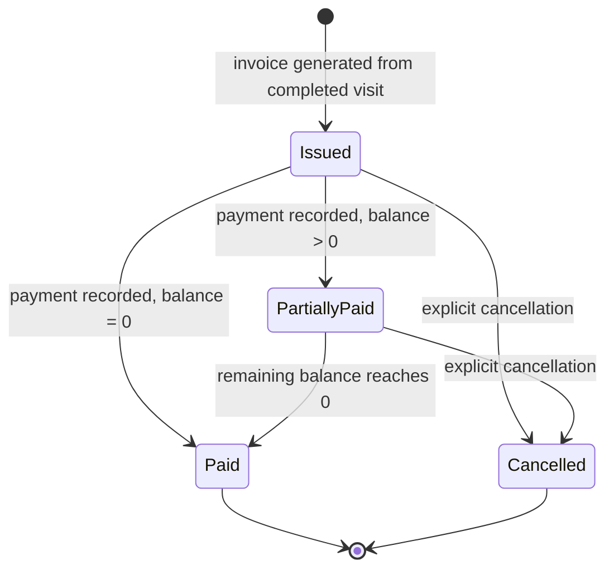

# Feature Specification: Financial Module (Invoicing & Payments)

**Feature Branch**: `003-financial-module`
**Created**: 2026-07-20
**Status**: Clarified — ready for `/speckit.plan`
**Depends on**: Clinical V1 (Patients, Visits, Visit Services) — completed and verified

## User Scenarios & Testing

### Primary User Story

As a receptionist or accountant, once a doctor marks a patient's visit as
completed, I need to generate an invoice reflecting exactly what was billed
during that visit, record one or more payments against it (the patient may
pay in full or in installments), and always know the correct outstanding
balance — so that the clinic's financial records are accurate and disputes
over "what was charged" can always be resolved by looking at the invoice
itself, unaffected by any later change to service pricing or to the
underlying visit.

### Acceptance Scenarios

1. **Given** a visit with status `completed` and one or more billed
   services, **When** staff generates an invoice for that visit, **Then**
   the invoice is created containing a line for each billed service, using
   the price that was actually charged during the visit, and an invoice
   total equal to the sum of those lines, permanently fixed at that moment.

2. **Given** a visit with status `completed` but zero billed services,
   **When** staff attempts to generate an invoice, **Then** the system
   rejects the request — an invoice with a zero total MUST NOT be created.

3. **Given** an existing invoice with a total of 100 and no payments
   recorded, **When** a payment of 40 is recorded, **Then** the invoice's
   remaining balance is reported as 60, and the invoice transitions to
   `partially_paid`.

4. **Given** an invoice with a remaining balance of 60, **When** a payment
   of 60 is recorded, **Then** the remaining balance becomes 0 and the
   invoice transitions to `paid`.

5. **Given** an invoice that has already been generated for a visit,
   **When** staff attempts to generate a second invoice for the same visit,
   **Then** the system rejects the request — a visit may have at most one
   invoice.

6. **Given** an invoice with status `issued` or later, **When** staff
   attempts to directly edit a line item on it, **Then** the system rejects
   the edit — correcting a finalized invoice requires an explicit
   adjustment/reversal action, not an in-place edit.

7. **Given** a visit that already has an invoice generated for it, **When**
   staff attempts to add, edit, or remove a billed service on that visit,
   **Then** the system rejects the change unless the invoice is first
   cancelled through an explicit business process.

8. **Given** an invoice with status `paid`, **When** any process attempts
   to transition it back to `issued`, **Then** the system rejects the
   transition — the state machine only moves forward or into `cancelled`.

9. **Given** two staff members simultaneously recording a payment against
   the same invoice at the moment it reaches full payment, **When** both
   submit at nearly the same time, **Then** the system MUST NOT allow the
   invoice to be overpaid or to end up in an inconsistent balance state —
   the same concurrent-safety guarantee already required and verified for
   appointment booking (see Constitution, Article IV).

### Invoice Lifecycle (State Machine)

**Transition rules:**
- There is no `Draft` state in this iteration — an invoice is generated
  already `Issued` directly from a completed visit (see FR-001, FR-003).
- `Paid` and `Cancelled` are terminal states. Neither may transition back
  to `Issued` or `PartiallyPaid` under any circumstance.
- Cancelling an invoice (from `Issued` or `PartiallyPaid`) does NOT reopen
  or alter the source visit. The visit remains `completed`. Any further
  correction is a separate, explicit adjustment/reversal process (out of
  scope — see below), not a re-opening of clinical records.

### Edge Cases

- What happens when a payment amount would exceed the current remaining
  balance (overpayment)? → System MUST reject the payment.
- What happens if staff attempts to generate an invoice for a visit that is
  not yet `completed`, or that has zero billed services? → System MUST
  reject the invoice generation in both cases (resolved — see FR-004).
- What happens to a visit's billed services once its invoice exists? →
  They become locked; see FR-013.
- How are partial refunds or invoice corrections after finalization
  handled? → Explicitly deferred to a follow-up spec (see Out of Scope).

## Requirements

### Functional Requirements

- **FR-001**: System MUST allow generating exactly one invoice per
  completed visit, containing one line item per billed service recorded on
  that visit.
- **FR-002**: Each invoice line item MUST preserve the exact service name
  and price as billed at the time the visit's treatment was recorded — a
  later change to the service's catalog price MUST NOT alter any existing
  invoice.
- **FR-003**: System MUST prevent generating more than one invoice for the
  same visit.
- **FR-004**: System MUST prevent invoice generation when the source visit
  is not `completed`, OR when the visit has no billed services recorded —
  a zero-total invoice MUST NOT be created.
- **FR-005**: System MUST allow recording one or more payments against an
  invoice, each with an amount (to exactly two decimal places), a payment
  date, a payment method, and the staff member who recorded it.
- **FR-006**: System MUST calculate the remaining balance of an invoice as
  its total minus the sum of all payments recorded against it, computed on
  read — not stored as a field a user can directly overwrite.
- **FR-007**: System MUST reject a payment whose amount would cause the
  invoice's remaining balance to go below zero.
- **FR-008**: System MUST transition an invoice through the states
  `Issued → PartiallyPaid → Paid` strictly forward as payments are
  recorded, and MUST reflect the correct state consistently even under
  concurrent payment submissions (no double-spend / no overpay race).
- **FR-009**: System MUST NOT allow direct in-place editing of a
  finalized (`Issued` or later) invoice's line items; correcting a
  finalized invoice requires a distinct adjustment mechanism (design
  deferred to a follow-up spec).
- **FR-010**: System MUST retain every invoice and every payment
  permanently — no hard delete of financial records (per Constitution,
  Article I). Cancelling an invoice MUST be expressed as a status
  transition to `Cancelled`, never a row deletion, and MUST NOT reopen or
  alter the source visit.
- **FR-011**: System MUST make each invoice retrievable by a
  human-readable reference number, generated through the same centralized
  numbering mechanism already used for patients and visits (per
  Constitution, Article V). Once assigned, an invoice number MUST NOT
  change and MUST NOT be reused, even if the invoice is later cancelled.
- **FR-012**: System MUST record, for every payment, which staff member
  recorded it and when.
- **FR-013**: Once an invoice has been generated for a visit, that visit's
  billed services (additions, edits, or removals) MUST NOT be modified
  unless the invoice is first cancelled through the explicit business
  process in FR-010. This keeps the invoice and the clinical treatment
  record from ever silently diverging.
- **FR-014**: An invoice's total MUST be computed once, as the sum of its
  line items at generation time, and stored as a fixed value — it MUST NOT
  be re-derived from the visit's billed services after generation, even if
  those services could theoretically still be queried.
- **FR-015**: System MUST capture the payment method for every payment
  (e.g., cash, card, bank transfer) as a discrete, reportable attribute —
  not free-text notes — sufficient to support "revenue by payment method"
  reporting later.
- **FR-016**: Recording a payment MUST be treated as a single atomic
  business transaction: the payment record and the invoice's resulting
  state MUST both succeed or both fail together, with no partially-applied
  outcome ever visible to a subsequent reader (per Constitution, Article
  III and IV).
- **FR-017**: Invoice numbers MUST never be reused, including numbers
  belonging to invoices that are later cancelled — the sequence only moves
  forward.
- **FR-018**: Payment records MUST NOT be editable or deletable after
  creation. Correcting a mistaken payment requires a reversing payment or
  adjustment entry, never a mutation of the original record (per
  Constitution, Article I, extended explicitly to payments).
- **FR-019**: A payment record MUST NOT be reversed more than once — attempting
  to create a second reversal against an already-reversed payment MUST be rejected.

### Key Entities

- **Invoice**: Represents the bill generated for a single completed visit.
  Has a fixed total amount (computed once at generation), a lifecycle
  status (`Issued` / `PartiallyPaid` / `Paid` / `Cancelled`), an immutable
  human-readable reference number, and belongs to exactly one Visit and
  one Patient.
- **Invoice Item**: Represents a single billed line on an invoice. A
  point-in-time snapshot of what was charged (service name, quantity,
  unit price, discount) — independent of the source Visit Service record
  after the invoice is generated, per Constitution Article II.
- **Payment**: Represents a single, immutable payment transaction against
  an Invoice. Has an amount, a date, a payment method, and the staff
  member who recorded it. Multiple Payments may exist per Invoice.

## Out of Scope (this iteration)

- Refunds and post-finalization invoice adjustments/reversals (needs its
  own spec once the base Invoice/Payment flow is validated).
- Multiple currencies.
- Online/electronic payment gateway integration (listed as future scope in
  the original product concept, not part of this module).
- Expense tracking (`expenses`) — related to profitability reporting, but
  a separate concern from invoicing a patient; may be its own spec.

## Clarifications

### Session 2026-07-20

- **Q1: Is a zero-total invoice (visit completed with no billed services)
  a valid state?**
  **A1**: No. Invoice generation MUST be rejected in that case (FR-004).

- **Q2: Should partial payments allow arbitrary decimal precision, or be
  constrained?**
  **A2**: Constrained to exactly two decimal places, consistent with
  standard currency handling (FR-005).

- **Q3: When an invoice is cancelled, does the source visit reopen for
  editing?**
  **A3**: No. The visit remains `completed` permanently. Any correction
  after cancellation is a separate, explicit adjustment process — the
  clinical record is never implicitly reopened by a financial action
  (FR-010, Invoice Lifecycle transition rules).

## Review & Acceptance Checklist

- [x] No implementation details (no table/column names, no framework
      specifics) — verified: this document describes behavior only.
- [x] Every functional requirement is independently testable.
- [x] Scope is bounded — Out of Scope section is explicit, not implied.
- [x] Clarifications resolved — all three open questions answered above.
- [x] State machine defined with explicit forward-only transition rules.